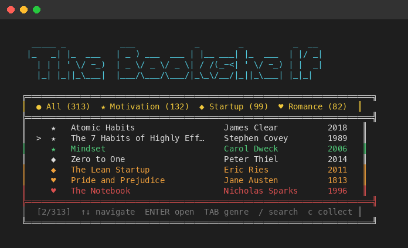
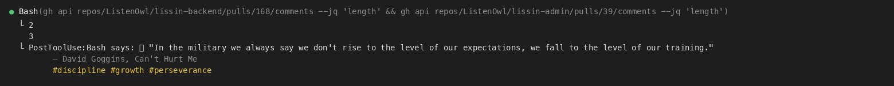

# Terminal Arcade

A collection of terminal-based games and apps built with Python and curses.


## Games

### Dino Run

An endless runner with 10 selectable dinosaurs, 3 rotating biomes, a charge-based roar mechanic, and retro audio.


[Read more →](dino_game/README.md)

### Snake

Classic Nokia snake for your terminal. Wrapping edges, speed progression, and bonus food.


[Read more →](snake_game/README.md)

### The Bookshelf

A terminal book discovery app with 313 books across motivation, startup, and romance genres. Browse, search, collect favorites, and explore quotes.




[Read more →](bookshelf/README.md)

## Requirements

- Python 3.10+
- A terminal with curses support (most Unix terminals, macOS Terminal, iTerm2)
- macOS for audio playback (optional — game works without sound)

## Install

```bash
git clone https://github.com/Amal-David/terminal-arcade.git
cd terminal-arcade
pip install -e .
```

If `pip` warns that `arcade`, `dino-run`, `snake-game`, or `bookshelf` were installed to a directory that is not on `PATH`, you can either run the modules directly or add the user script directory to `PATH`.

User script directories:

| OS | Script directory |
|---|---|
| macOS | `$(python3 -m site --user-base)/bin` |
| Linux | `$(python3 -m site --user-base)/bin` |
| Windows | `$(py -m site --user-base)\Scripts` |

Examples:

```bash
# macOS / Linux: temporary PATH update for the current shell
export PATH="$(python3 -m site --user-base)/bin:$PATH"

# macOS / Linux: run without touching PATH
python3 -m terminal_arcade
python3 -m dino_game
python3 -m snake_game
python3 -m bookshelf
```

```powershell
# Windows PowerShell: temporary PATH update for the current session
$env:Path = "$(py -m site --user-base)\Scripts;$env:Path"

# Windows: run without touching PATH
py -m terminal_arcade
py -m dino_game
py -m snake_game
py -m bookshelf
```

## Run

```bash
# Full arcade launcher
arcade
# or: python3 -m terminal_arcade
# or on Windows: py -m terminal_arcade

# Direct shortcuts

# Dino Run
dino-run
# or: python3 -m dino_game
# or on Windows: py -m dino_game

# Snake
snake-game
# or: python3 -m snake_game
# or on Windows: py -m snake_game

# The Bookshelf
bookshelf
# or: python3 -m bookshelf
# or on Windows: py -m bookshelf
```

## Claude Code Ambient Quotes

A PostToolUse hook for [Claude Code](https://claude.ai/code) that delivers contextually relevant book quotes during your coding sessions. After every few tool calls, a quote appears — matched to what you're doing.



### Quick Start

**Requirements:** Python 3.10+, Claude Code (CLI, desktop app, or IDE extension)

**Step 1.** Clone and install:

```bash
git clone https://github.com/Amal-David/terminal-arcade.git
cd terminal-arcade
pip install -e .
```

> The `pip install -e .` step is required — the hook imports the bookshelf data module.

**Step 2.** Open `~/.claude/settings.json` and add the hook.

If you **don't have any hooks yet**, add this to your settings:

```json
{
  "hooks": {
    "PostToolUse": [
      {
        "hooks": [
          {
            "type": "command",
            "command": "python3 /path/to/terminal-arcade/bookshelf/skill/hook.py",
            "timeout": 5
          }
        ]
      }
    ]
  }
}
```

If you **already have hooks**, just add a new entry to the existing `PostToolUse` array:

```json
{
  "hooks": {
    "PostToolUse": [
      { "hooks": [{ "type": "command", "command": "your-existing-hook" }] },
      {
        "hooks": [
          {
            "type": "command",
            "command": "python3 /path/to/terminal-arcade/bookshelf/skill/hook.py",
            "timeout": 5
          }
        ]
      }
    ]
  }
}
```

**Step 3.** Replace `/path/to/terminal-arcade` with the actual path where you cloned the repo.

**Step 4.** Restart Claude Code. Quotes will start appearing after every few tool calls.

This works everywhere Claude Code runs — the CLI (`claude`), the desktop app, and VS Code / JetBrains extensions. They all share `~/.claude/settings.json`.

### Configuration

Optionally tweak the hook behavior by creating a config file:

| Platform | Config path |
|----------|-------------|
| macOS | `~/Library/Application Support/bookshelf/config.json` |
| Linux | `~/.local/share/bookshelf/config.json` |
| Windows | `%APPDATA%/bookshelf/config.json` |

```json
{
  "quote_cadence": 5,
  "context_matching": true
}
```

| Setting | Default | Description |
|---------|---------|-------------|
| `quote_cadence` | 5 | Show a quote every Nth tool call |
| `context_matching` | true | Match quotes to your coding context |

### How it works

The hook runs after every tool call. It tracks a counter and shows a quote every `quote_cadence` calls. When `context_matching` is enabled, it reads the tool name, command, and file path to pick a relevant quote:

| Coding Context | Quote Tags |
|---------------|------------|
| Debugging, fixing bugs | perseverance, resilience, patience |
| Building, creating | creativity, ambition, innovation |
| Testing | discipline, focus, perseverance |
| Shipping, deploying | courage, risk, ambition |
| Refactoring | simplicity, growth, change |
| Late night work | solitude, perseverance, focus |

### Troubleshooting

**`ModuleNotFoundError: No module named 'bookshelf'`**
You need to install the package. Run `pip install -e .` from the repo root.

**No quotes appearing**
- Check that the path in `settings.json` points to the actual `hook.py` location
- The hook shows a quote every 5th tool call by default — use a few tools and wait
- Verify Python 3.10+ is your default `python3`

**Quotes aren't matching my context**
- Make sure `context_matching` is `true` in your config file (it is by default)
- Context matching reads the tool name and command — it works best with Bash, Read, and Edit calls

## Test

```bash
python3 -m unittest discover -s tests -v
```

## License

[MIT](LICENSE)
