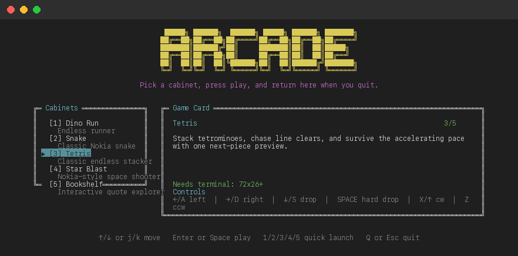
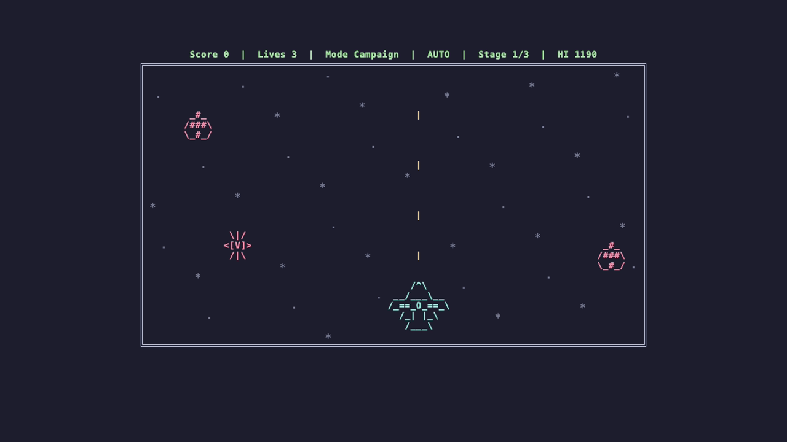
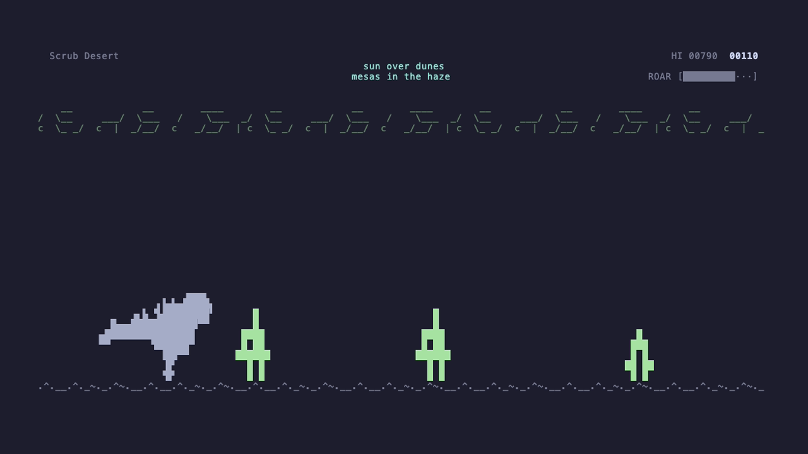
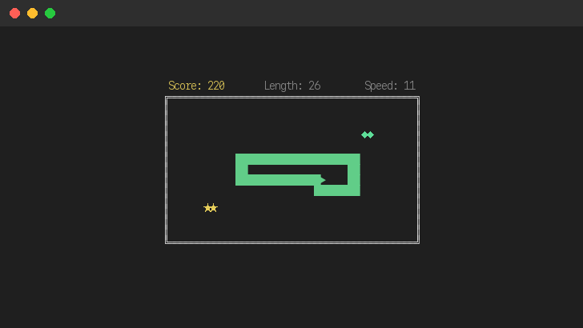
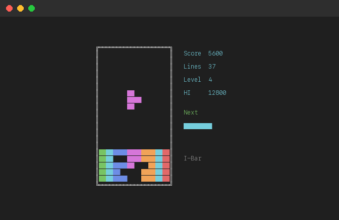
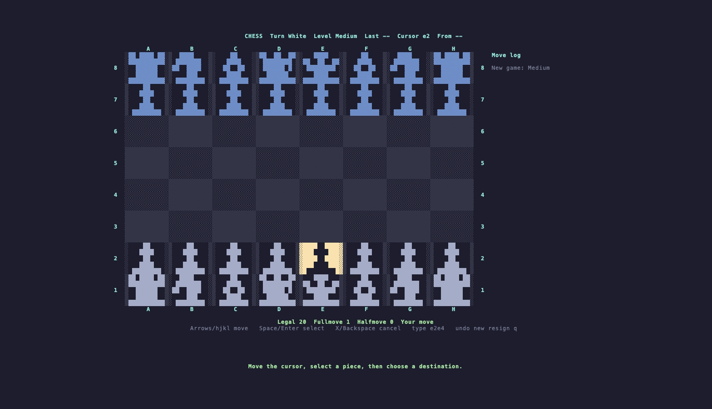
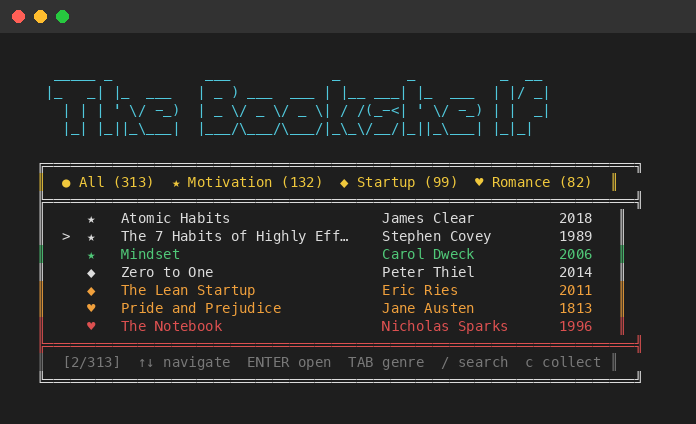
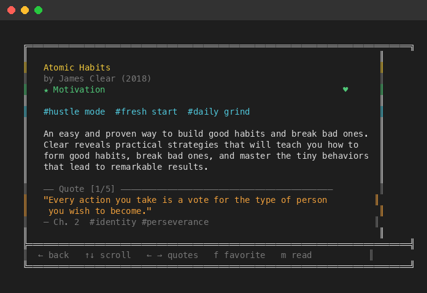
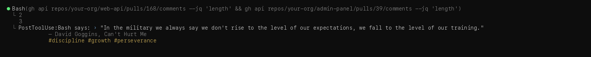

# Terminal Arcade

A retro arcade for your terminal — pure Python, zero dependencies, curses-based. Six fully-playable games, an interactive bookshelf, **Wonder** — a daily fact-or-story cabinet — and **Polyglot** — pick one of 20 language pairs and learn it ambiently while you work — all behind a single launcher. Plus drop-in **Claude Code** and **Codex** hooks that surface a curated book quote, a daily wonder, or a language phrase every Nth tool call — configurable cadence (5 / 10 / 20) so the wisdom lands without breaking your flow.

```bash
python3 -m bookshelf.skill.cadence 10   # one quote per 10 tool calls
```

**Topics:** `python` · `terminal` · `curses` · `arcade` · `retro-games` · `games` · `cli` · `claude-code` · `codex` · `bookshelf` · `polyglot` · `language-learning` · `ascii-art` · `chiptune`



## Games

### Star Blast

A large-sprite terminal space shooter with a full-size ship, asteroid obstacles, enemy craft, carrier bosses, punchier blast/impact effects, CC0 sci-fi SFX, campaign stages, and endless survival.



[Read more →](star_blast/README.md)

### Terminal Kombat

An original large-sprite 16-bit terminal fighter with selectable warriors, CPU pressure, best-of-three rounds, jumps, crouches, throws, sweeps, blocking, meter, specials, and finishers.

```bash
python3 -m kombat_game              # or: terminal-kombat
```

[Read more →](kombat_game/README.md)

### Dino Run

An endless runner with 10 selectable dinosaurs, 3 rotating biomes, a charge-based roar mechanic, and retro audio.



[Read more →](dino_game/README.md)

### Snake

Classic Nokia snake for your terminal. Wall collisions, speed progression, and bonus food.



[Read more →](snake_game/README.md)

### Tetris

Classic endless block stacking with standard wall kicks, one next-piece preview, and level-based speed-up.



[Read more →](tetris_game/README.md)

### Chess

Play White against a built-in rule-based engine on a full-screen pixel-art board with easy, medium, and hard difficulty levels.



[Read more →](chess_game/README.md)

### The Bookshelf

A terminal book discovery app with 313 books across motivation, startup, and romance genres. Browse, search, collect favorites, and explore quotes.




[Read more →](bookshelf/README.md)

### Wonder

Pick a mood — funny, heartwarming, weird, or inspiring — and pull one fresh fact or story from the internet for the day. Caches the day's pick so re-opens are instant, falls back to a bundled curated set when offline, and lets you save anything that landed for later. Zero external dependencies — uses stdlib `urllib` and free public APIs (icanhazdadjoke, uselessfacts, r/UpliftingNews, r/MadeMeSmile).

```bash
python3 -m wonder              # or: wonder
```

### Polyglot

Pick one of 20 language pairs (English ↔ Spanish, French, German, Italian, Portuguese, Japanese, Korean, Mandarin, Russian, Arabic, Hindi, Dutch, Swedish, Turkish, plus six reverse pairs into English) and Polyglot installs a Claude Code + Codex hook that surfaces a phrase from that pair every Nth tool call — letters, vocab, full sentences with pronunciation, ~250 items per pair (~5,000 total). Switching pairs never re-edits `settings.json`; only the active-pair config flips, so override is instant.

```bash
python3 -m polyglot                          # or: polyglot   — opens the 20-pair cabinet
python3 -m polyglot.skill.installer status   # see what's installed and which pair is active
python3 -m polyglot.skill.cadence 10 --both  # one phrase per 10 events on both Claude and Codex
```

## Requirements

- Python 3.10+
- A terminal with curses support (most Unix terminals, macOS Terminal, iTerm2)
- macOS for audio playback (optional — game works without sound)

## Install

```bash
git clone https://github.com/Amal-David/terminal-arcade.git
cd terminal-arcade
pip install -e .
```

### `error: externally-managed-environment` (Homebrew Python, PEP 668)

Newer Pythons (e.g. Homebrew's `python@3.13` / `python@3.14`) refuse a bare `pip install` to protect the system install. Either use `pipx`, a venv, or pass `--user --break-system-packages`:

```bash
# Option A — pipx (recommended; isolates the install)
brew install pipx
pipx install -e .

# Option B — venv
python3 -m venv .venv && source .venv/bin/activate
pip install -e .

# Option C — user install with the override
pip install --user --break-system-packages -e .
```

### `command not found: arcade` after install

`pip` writes the launchers (`arcade`, `dino-run`, `snake-game`, `tetris`, `chess-game`, `star-blast`, `terminal-kombat`, `bookshelf`, `wonder`, `polyglot`) into Python's user-script directory, which is **not on `PATH` by default** on macOS. Add it permanently:

```bash
# macOS / Linux — add to ~/.zshrc (or ~/.bashrc) and reload your shell
echo 'export PATH="$(python3 -m site --user-base)/bin:$PATH"' >> ~/.zshrc
source ~/.zshrc
```

User script directories:

| OS | Script directory |
|---|---|
| macOS | `$(python3 -m site --user-base)/bin` |
| Linux | `$(python3 -m site --user-base)/bin` |
| Windows | `$(py -m site --user-base)\Scripts` |

Prefer not to touch `PATH`? Run the modules directly instead — this always works after `pip install -e .`:

```bash
python3 -m terminal_arcade   # full launcher (or: arcade)
python3 -m dino_game
python3 -m snake_game
python3 -m tetris_game
python3 -m chess_game
python3 -m star_blast
python3 -m kombat_game
python3 -m bookshelf
python3 -m wonder
python3 -m polyglot
```

```powershell
# Windows PowerShell: temporary PATH update for the current session
$env:Path = "$(py -m site --user-base)\Scripts;$env:Path"

# Windows: run without touching PATH
py -m terminal_arcade
py -m dino_game
py -m snake_game
py -m tetris_game
py -m chess_game
py -m star_blast
py -m kombat_game
py -m bookshelf
py -m wonder
py -m polyglot
```

## Run

The module form (`python3 -m ...`) always works after `pip install -e .`. The short script names (`arcade`, `dino-run`, etc.) only work if the user script directory is on your `PATH` — see the install notes above if `command not found`.

```bash
# Full arcade launcher (recommended — always works)
python3 -m terminal_arcade
# or, if user scripts are on PATH: arcade
# Windows: py -m terminal_arcade

# Direct shortcuts

# Dino Run
python3 -m dino_game        # or: dino-run        # Windows: py -m dino_game

# Snake
python3 -m snake_game       # or: snake-game      # Windows: py -m snake_game

# Tetris
python3 -m tetris_game      # or: tetris          # Windows: py -m tetris_game

# Chess
python3 -m chess_game       # or: chess-game      # Windows: py -m chess_game

# Star Blast
python3 -m star_blast       # or: star-blast      # Windows: py -m star_blast

# Terminal Kombat
python3 -m kombat_game      # or: terminal-kombat # Windows: py -m kombat_game

# The Bookshelf
python3 -m bookshelf        # or: bookshelf       # Windows: py -m bookshelf

# Wonder
python3 -m wonder           # or: wonder          # Windows: py -m wonder

# Polyglot
python3 -m polyglot         # or: polyglot        # Windows: py -m polyglot
```

## Claude Code Ambient Quotes

A PostToolUse hook for [Claude Code](https://claude.ai/code) that delivers contextually relevant book quotes during your coding sessions. After every few tool calls, a quote appears — matched to what you're doing.



### Quick Start

**Requirements:** Python 3.10+, Claude Code (CLI, desktop app, or IDE extension)

**Step 1.** Clone and install:

```bash
git clone https://github.com/Amal-David/terminal-arcade.git
cd terminal-arcade
pip install -e .
```

> The `pip install -e .` step is required — the hook imports the bookshelf data module.

**Step 2.** Open `~/.claude/settings.json` and add the hook.

If you **don't have any hooks yet**, add this to your settings:

```json
{
  "hooks": {
    "PostToolUse": [
      {
        "hooks": [
          {
            "type": "command",
            "command": "python3 /path/to/terminal-arcade/bookshelf/skill/hook.py",
            "timeout": 5
          }
        ]
      }
    ]
  }
}
```

If you **already have hooks**, just add a new entry to the existing `PostToolUse` array:

```json
{
  "hooks": {
    "PostToolUse": [
      { "hooks": [{ "type": "command", "command": "your-existing-hook" }] },
      {
        "hooks": [
          {
            "type": "command",
            "command": "python3 /path/to/terminal-arcade/bookshelf/skill/hook.py",
            "timeout": 5
          }
        ]
      }
    ]
  }
}
```

**Step 3.** Replace `/path/to/terminal-arcade` with the actual path where you cloned the repo.

**Step 4.** Restart Claude Code. Quotes will start appearing after every few tool calls.

This works everywhere Claude Code runs — the CLI (`claude`), the desktop app, and VS Code / JetBrains extensions. They all share `~/.claude/settings.json`.

### Configuration

Optionally tweak the hook behavior by creating a config file:

| Platform | Config path |
|----------|-------------|
| macOS | `~/Library/Application Support/bookshelf/config.json` |
| Linux | `~/.local/share/bookshelf/config.json` |
| Windows | `%APPDATA%/bookshelf/config.json` |

```json
{
  "quote_cadence": 5,
  "context_matching": true
}
```

| Setting | Default | Description |
|---------|---------|-------------|
| `quote_cadence` | 5 | Show a quote every Nth tool call |
| `context_matching` | true | Match quotes to your coding context |

Common cadence values are `5` (default), `10`, or `20`. Flip between them without editing JSON:

```bash
python3 -m bookshelf.skill.cadence              # show current
python3 -m bookshelf.skill.cadence 10           # set Claude cadence to 10
python3 -m bookshelf.skill.cadence 20 --codex   # set Codex cadence to 20
python3 -m bookshelf.skill.cadence 10 --both    # set both to 10
```

### How it works

The hook runs after every tool call. It tracks a counter and shows a quote every `quote_cadence` calls. When `context_matching` is enabled, it reads the tool name, command, and file path to pick a relevant quote:

| Coding Context | Quote Tags |
|---------------|------------|
| Debugging, fixing bugs | perseverance, resilience, patience |
| Building, creating | creativity, ambition, innovation |
| Testing | discipline, focus, perseverance |
| Shipping, deploying | courage, risk, ambition |
| Refactoring | simplicity, growth, change |
| Late night work | solitude, perseverance, focus |

### Troubleshooting

**`ModuleNotFoundError: No module named 'bookshelf'`**
You need to install the package. Run `pip install -e .` from the repo root.

**No quotes appearing**
- Check that the path in `settings.json` points to the actual `hook.py` location
- The hook shows a quote every 5th tool call by default — use a few tools and wait
- Verify Python 3.10+ is your default `python3`

**Quotes aren't matching my context**
- Make sure `context_matching` is `true` in your config file (it is by default)
- Context matching reads the tool name and command — it works best with Bash, Read, and Edit calls

## Codex Ambient Quotes

A `notify` hook for [Codex](https://github.com/openai/codex) that delivers a book quote every 5 turns while you work.

> Codex's `notify` only fires on `turn-ended` (once per assistant response, not per tool call) and does not render the hook's stdout in chat. So the Codex flavor surfaces quotes via macOS notification on every 5th turn. On Linux/Windows the quote is written to Codex's turn log via stderr.

### Quick Start

**Requirements:** Python 3.10+, [Codex](https://github.com/openai/codex), macOS for the notification surface (Linux/Windows fall back to log output)

**Step 1.** Clone and install (skip if you already did this for the Claude hook):

```bash
git clone https://github.com/Amal-David/terminal-arcade.git
cd terminal-arcade
pip install -e .
```

**Step 2.** Open `~/.codex/config.toml` and add the `notify` line at the top level:

```toml
notify = ["python3", "/path/to/terminal-arcade/bookshelf/skill/codex_notify.py"]
```

If you **already have a `notify` line**, Codex only honors one entry — wrap both behind a tiny dispatcher script that calls each in turn, or pick whichever you need most.

**Step 3.** Replace `/path/to/terminal-arcade` with the actual path where you cloned the repo.

**Step 4.** Restart Codex. A book quote will pop as a macOS notification on every 5th turn.

### Configuration

The Codex hook reads the same config file as the Claude hook:

| Platform | Config path |
|----------|-------------|
| macOS | `~/Library/Application Support/bookshelf/config.json` |
| Linux | `~/.local/share/bookshelf/config.json` |
| Windows | `%APPDATA%/bookshelf/config.json` |

```json
{
  "codex_quote_cadence": 5
}
```

| Setting | Default | Description |
|---------|---------|-------------|
| `codex_quote_cadence` | 5 | Show a quote every Nth Codex turn |

The Codex counter (`codex_turn_count`) is tracked separately from Claude's tool-call counter, so the two hooks don't interfere if you run both.

### How it works

Codex calls the script with `turn-ended <json_payload>` after every assistant turn. The script ignores all other events, increments its own turn counter, and on every Nth turn picks a quote and surfaces it as a macOS notification (`osascript`). Quote selection reuses the same picker as the Claude hook — recently-shown quotes are deprioritized and the unseen pool is exhausted before repeats.

### Troubleshooting

**`ModuleNotFoundError: No module named 'bookshelf'`**
Run `pip install -e .` from the repo root.

**No notifications appearing**
- Confirm `osascript -e 'display notification "test" with title "test"'` works in your terminal — Notification Center may need permission for your terminal app under System Settings → Notifications.
- The hook fires every 5 turns by default — keep working, it'll show up.
- Check that the path in `~/.codex/config.toml` points to the actual `codex_notify.py` location.

**Notifications appear too often / not often enough**
Bump `codex_quote_cadence`. Cadence counts Codex turns (one per assistant response), not individual tool calls.

## Daily Wonder Hooks

The Wonder cabinet also doubles as an ambient hook for Claude Code and Codex. Once a day (by default) you'll get one fresh fact or story — funny, heartwarming, weird, or inspiring — surfaced inline while you work. The hook never touches the network from the hook path itself: it reads whatever the Wonder app has cached for today, or falls back to a bundled curated pick if nothing's cached yet. Open the cabinet (`python3 -m wonder`) any time to pre-warm tomorrow's pick.

### Quick Start — Claude Code

**Requirements:** Python 3.10+, Claude Code, `pip install -e .` already run

Add to `~/.claude/settings.json` (alongside any existing hook):

```json
{
  "hooks": {
    "PostToolUse": [
      {
        "hooks": [
          {
            "type": "command",
            "command": "python3 /path/to/terminal-arcade/wonder/skill/hook.py",
            "timeout": 5
          }
        ]
      }
    ]
  }
}
```

Replace `/path/to/terminal-arcade` with the real path. Restart Claude Code. The first tool call each day surfaces a Wonder via `systemMessage`; subsequent calls that day are silent.

### Quick Start — Codex

Add the notify line to `~/.codex/config.toml`:

```toml
notify = ["python3", "/path/to/terminal-arcade/wonder/skill/codex_notify.py"]
```

On macOS the wonder pops as a Notification Center alert on the first turn each day; other platforms get a stderr line in the turn log.

### Cadence

`daily` is the default. Switch with the CLI:

```bash
python3 -m wonder.skill.cadence                  # show current
python3 -m wonder.skill.cadence daily            # Claude: once per day (default)
python3 -m wonder.skill.cadence 5                # Claude: every 5th tool call
python3 -m wonder.skill.cadence off              # Claude: disable
python3 -m wonder.skill.cadence 10 --codex       # Codex: every 10th turn
python3 -m wonder.skill.cadence daily --both     # both: once per day
```

By default the hook rotates through Funny → Heartwarming → Weird → Inspiring across days. Pin a single mood instead:

```bash
python3 -m wonder.skill.cadence --category funny
python3 -m wonder.skill.cadence --category rotate    # back to the daily rotation
```

| Setting | Default | Description |
|---------|---------|-------------|
| `wonder_cadence` | `daily` | Claude hook: `daily` / `<int>` / `off` |
| `codex_wonder_cadence` | `daily` | Codex hook: `daily` / `<int>` / `off` |
| `wonder_category` | `rotate` | `rotate`, `funny`, `heartwarming`, `weird`, `inspiring`, or `surprise` |

Config lives in the same file as the Wonder app — `wonder/config.json` under the app's data directory (e.g. `~/Library/Application Support/wonder/` on macOS). The Wonder app's daily `cache.json` is the source of truth for what the hook surfaces.

### Troubleshooting

**`ModuleNotFoundError: No module named 'wonder'`**
Run `pip install -e .` from the repo root.

**Always shows the same offline pick**
Open the Wonder cabinet at least once so it can fetch live content for today: `python3 -m wonder`. Until then the hook surfaces the deterministic bundled fallback, which is the same each time you call within a day.

**Want a fresh pick mid-day**
Inside the Wonder cabinet, press `R` to force-refresh the current category. The hook will pick up the new cached entry on its next fire.

## Polyglot Ambient Phrases

Polyglot is the first arcade cabinet with a **one-step installer** — opening the cabinet, picking a language pair, and pressing `I` writes the Claude Code + Codex hook entries for you (after showing you the unified diff and asking for confirmation). Switching pairs later never touches `settings.json` again — only the polyglot config's active-pair flips, so override is instant and there's never a stale hook entry to clean up.

The dataset ships with **20 language pairs × ~250 phrases each = ~5,000 phrases total**, across:

- **EN → XX (14 pairs):** Spanish, French, German, Italian, Portuguese (Brazilian), Japanese, Korean, Mandarin (Simplified), Russian, Arabic (MSA), Hindi, Dutch, Swedish, Turkish
- **XX → EN (6 pairs):** Spanish, Portuguese, French, German, Japanese, Korean

Each pair covers the script/alphabet, numbers and time, core vocab (colors, family, food, drink, body, weather, animals, verbs, adjectives), travel/work phrases (greetings, courtesy, restaurant, directions, emergency), and ~75 everyday sentences — every entry with a pronunciation hint in the appropriate scheme (Hepburn for Japanese, Revised Romanization for Korean, Pinyin with tone numbers for Mandarin, BGN/PCGN for Russian, IAST for Hindi, ALA-LC for Arabic, English-friendly stress hints for Latin-script pairs).

### Quick Start

**Requirements:** Python 3.10+, Claude Code or Codex (or both), `pip install -e .` already run

```bash
python3 -m polyglot                     # or: polyglot
```

Use arrow keys to move across the grid of 20 pairs. Press `Enter` to browse a pair's content by category, or `I` to install that pair as the active hook directly from the grid.

The installer:

1. Shows the current active pair (if any) and which target it's replacing.
2. Reports whether the Claude and Codex hooks are already installed.
3. Prints a unified diff of the proposed `~/.claude/settings.json` change.
4. Prompts for confirmation (`y/N`) before writing.
5. Falls back to printing the manual JSON/TOML snippet if the settings file can't be written.

Switch pairs any time by reopening polyglot and picking a different one — no further confirmation needed for the hook entry itself, since it's already wired.

### Cadence

```bash
python3 -m polyglot.skill.cadence              # show current
python3 -m polyglot.skill.cadence 10           # Claude: every 10th tool call
python3 -m polyglot.skill.cadence 20 --codex   # Codex: every 20th turn
python3 -m polyglot.skill.cadence 10 --both    # both
```

### CLI installer

For headless or scripted setups you can drive the installer from the shell:

```bash
python3 -m polyglot.skill.installer status               # show active pair + hook state
python3 -m polyglot.skill.installer install --pair en-es # confirm-and-install
python3 -m polyglot.skill.installer install --print      # just print snippets, no write
python3 -m polyglot.skill.installer install --yes        # skip confirmation prompts
python3 -m polyglot.skill.installer set-pair en-ja       # switch active pair without re-installing
python3 -m polyglot.skill.installer uninstall            # remove the polyglot Claude hook
```

Manual fallback (if the installer can't write the file): drop this into `~/.claude/settings.json`:

```json
{
  "hooks": {
    "PostToolUse": [
      {
        "hooks": [
          {
            "type": "command",
            "command": "python3 /path/to/terminal-arcade/polyglot/skill/hook.py",
            "timeout": 5
          }
        ]
      }
    ]
  }
}
```

And this into `~/.codex/config.toml`:

```toml
notify = ["python3", "/path/to/terminal-arcade/polyglot/skill/codex_notify.py"]
```

### How it works

The hook entry in `settings.json` always points at `polyglot/skill/hook.py`. On each fire it reads the active pair id from polyglot's own config (`~/Library/Application Support/polyglot/config.json` on macOS, `~/.local/share/polyglot/` on Linux), picks a phrase from that pair's content with the same variety algorithm as bookshelf (deprioritize recently shown, exhaust the unseen pool before repeating), and emits a `systemMessage` like:

```
🌍 hola  [oh-LAH]
   — "hello" (English → Spanish)
   [1/264 unique phrases shown]
```

Picker state resets automatically when you switch pairs, so variety scoring starts fresh in each language.

### Troubleshooting

**`ModuleNotFoundError: No module named 'polyglot'`**
Run `pip install -e .` from the repo root.

**No phrases appearing**
- Confirm a pair is active: `python3 -m polyglot.skill.installer status` should print `Active pair:` with a non-empty value.
- The hook fires every 5 tool calls by default — use a few tools and wait.
- Verify the hook entry exists in `~/.claude/settings.json`.

**Want to switch language without re-confirming the JSON change**
Either open polyglot and pick a new pair (the active pair flips silently), or run `python3 -m polyglot.skill.installer set-pair en-ja`.

## Test

```bash
python3 -m unittest discover -s tests -v
```

## License

[MIT](LICENSE)
