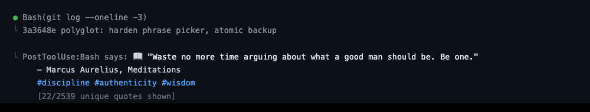

# The Bookshelf

A terminal book discovery and collection manager with 313 curated books, integrated quotes, and reading lists.


## Run

```bash
# From the repo root
python3 -m bookshelf

# Or install and run anywhere
pip install -e .
bookshelf
```

## Controls

| Key | Action |
|---|---|
| `Up` / `Down` / `j` / `k` | Navigate books |
| `Enter` / `Right` | Open selected book |
| `Esc` / `Left` / `q` | Back / Quit |
| `PgUp` / `PgDn` | Page up / down |
| `Tab` / `Shift+Tab` | Cycle genre filter or collection tabs |
| `/` | Search |
| `c` | Open collection |
| `r` | Pick a random book |
| `f` | Toggle favorite |
| `Left` / `Right` / `n` / `p` | Browse quotes (detail screen) |
| `m` | Mark as read |
| `w` | Want to read |
| `?` | Show help overlay |

## Screens

### Shelf (Main Browse)

Browse all 313 books filtered by genre. Genre tabs at the top show counts for All, Motivation, Startup, and Romance.

### Book Detail

View a book's summary, mood tags, and quotes. Scroll through quotes with left/right arrows. Mark books as favorites, read, or want-to-read.


### Search

Live search by title or author with real-time filtering and result counts.

### Collection

Manage your reading lists across four tabs:

- **Favorites** — Books you've hearted
- **Read** — Books you've finished
- **Want to Read** — Your wishlist
- **Stats** — Books explored, quotes seen, and library totals

## Library

313 books across 3 genres:

| Genre | Books | Icon |
|---|---|---|
| Motivation | 132 | ★ |
| Startup | 99 | ◆ |
| Romance | 82 | ♥ |

Each book includes mood tags (e.g. "hustle mode", "cozy night", "fresh start") and the quote catalog has 2,500+ quotes with context tags.

## Persistence

Reading lists and stats are saved to `~/.config/bookshelf/state.json`. Optional preferences can be set in `~/.config/bookshelf/config.json`.

## Ambient Hook — Claude Code

A PostToolUse hook that surfaces a contextually relevant quote during your coding sessions. After every few tool calls, a quote appears inline — matched to what you're doing.



**Requirements:** Python 3.10+, Claude Code, `pip install -e .` already run

Add to `~/.claude/settings.json`:

```json
{
  "hooks": {
    "PostToolUse": [
      {
        "hooks": [
          {
            "type": "command",
            "command": "python3 /path/to/terminal-arcade/bookshelf/skill/hook.py",
            "timeout": 5
          }
        ]
      }
    ]
  }
}
```

Replace `/path/to/terminal-arcade` with the actual clone path. Restart Claude Code — quotes appear every 5 tool calls by default.

### Cadence

```bash
python3 -m bookshelf.skill.cadence              # show current
python3 -m bookshelf.skill.cadence 10           # Claude: every 10th tool call
python3 -m bookshelf.skill.cadence 20 --codex   # Codex: every 20th turn
python3 -m bookshelf.skill.cadence 10 --both    # both
```

### Configuration

Config file locations:

| Platform | Path |
|----------|------|
| macOS | `~/Library/Application Support/bookshelf/config.json` |
| Linux | `~/.local/share/bookshelf/config.json` |
| Windows | `%APPDATA%/bookshelf/config.json` |

```json
{
  "quote_cadence": 5,
  "context_matching": true
}
```

| Setting | Default | Description |
|---------|---------|-------------|
| `quote_cadence` | 5 | Show a quote every Nth tool call |
| `context_matching` | true | Match quotes to your coding context |

When context matching is on, the hook reads the tool name, command, and file path to pick a relevant quote:

| Coding context | Quote tags |
|----------------|------------|
| Debugging, fixing | perseverance, resilience, patience |
| Building, creating | creativity, ambition, innovation |
| Testing | discipline, focus, perseverance |
| Shipping, deploying | courage, risk, ambition |
| Refactoring | simplicity, growth, change |

### Troubleshooting

**`ModuleNotFoundError: No module named 'bookshelf'`** — run `pip install -e .` from the repo root.

**No quotes appearing** — check the path in `settings.json`; the hook shows a quote every 5th call by default, so use a few tools first; verify Python 3.10+.

**Quotes aren't matching context** — ensure `context_matching` is `true` in your config (it is by default).

## Ambient Hook — Codex

A `notify` hook that delivers a book quote every 5 turns while you work.

> Codex's `notify` fires on `turn-ended` (once per assistant response, not per tool call) and does not render stdout in chat. Quotes surface as macOS Notification Center alerts; Linux/Windows fall back to stderr in the turn log.

Add to `~/.codex/config.toml`:

```toml
notify = ["python3", "/path/to/terminal-arcade/bookshelf/skill/codex_notify.py"]
```

If you already have a `notify` line, Codex only honors one entry — wrap both behind a small dispatcher script.

The Codex hook reads the same config file as the Claude hook (key: `codex_quote_cadence`). The Codex counter is tracked separately so the two hooks don't interfere if you run both.

### Troubleshooting

**No notifications** — confirm `osascript -e 'display notification "test" with title "test"'` works; Notification Center may need permission for your terminal under System Settings → Notifications. The hook fires every 5 turns by default.

**Too often / not often enough** — adjust `codex_quote_cadence`. Cadence counts Codex turns (one per assistant response), not individual tool calls.

## License

[MIT](../LICENSE)
