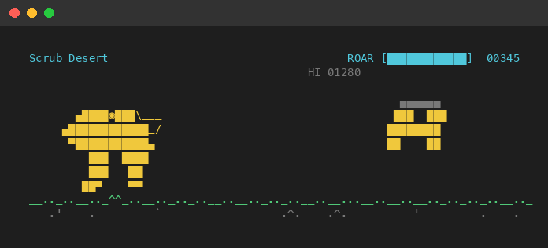
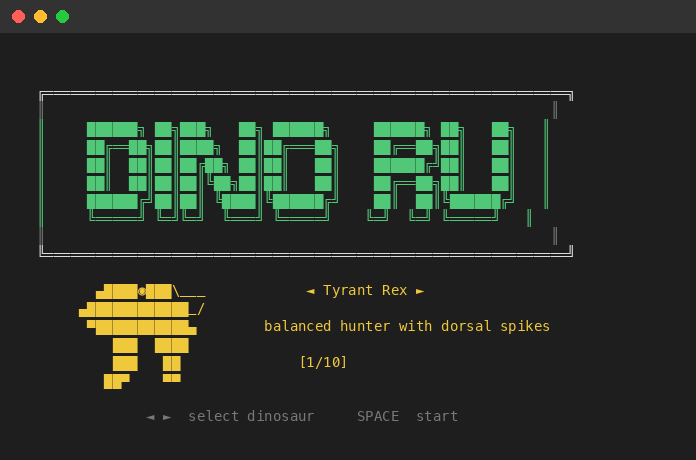
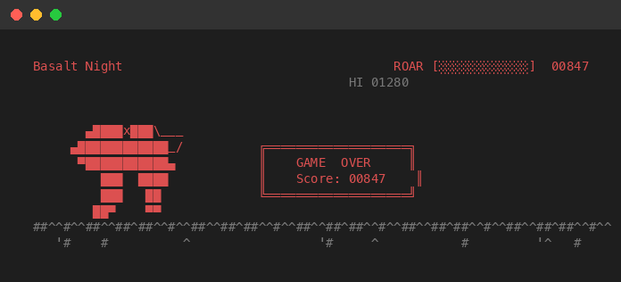

# Dino Run

A terminal endless runner with a roster of 10 dinosaurs, 3 rotating biomes, a charge-based roar move, and retro audio.



## Run

```bash
# From the repo root
python3 -m dino_game

# Or install and run anywhere
pip install -e .
dino-run
```

## Controls

| Key | Action |
|---|---|
| `Space` / `Up` / `W` | Jump |
| `Down` / `S` | Duck (or fast-fall while airborne) |
| `X` | Roar burst (when meter is full) |
| `Left` / `Right` / `A` / `D` | Select dinosaur (title screen) |
| `1`–`0` | Jump to dinosaur by number |
| `P` | Pause / Resume |
| `R` / `Space` / `Enter` | Restart after game over |
| `Q` / `Esc` | Quit |

## Dinosaur Roster

Choose from 10 dinosaurs, each with unique sprite animations:

1. **Tyrant Rex** — SVG-inspired rex with dorsal spikes and a wider jaw
2. **Allosaur** — Balanced hunter with a deep skull
3. **Ceratosaur** — Nose horn and a leaner skull
4. **Carnotaur** — Bull horns and a blunt snout
5. **Dilophosaur** — Double crests and a narrow face
6. **Monolophosaur** — Single crest and a compact bite
7. **Cryolophosaur** — Swept pompadour crest and sharp jaw
8. **Spinosaur** — Long snout with a sail-backed silhouette
9. **Acrocanthosaur** — Tall dorsal ridge and powerful stride
10. **Raptor** — Lean runner with a fast, narrow muzzle



## Biomes

The environment rotates every 300 points:

- **Scrub Desert** — Sun-baked dunes with desert pads, stumps, and scavenger birds
- **Fern Grove** — Layered fern ridge with fossil ribs, spires, and heaps
- **Basalt Night** — Moonlit crags with basalt spikes, vents, and shards

Each biome has its own ground texture, skyline, and obstacle set. Fragile obstacles (stumps, heaps, shards) can be destroyed with the roar burst.

## Roar Mechanic

The roar meter charges over time. When full, press `X` to unleash a burst that destroys nearby fragile hazards and grants +25 bonus score per hit. An audio cue plays when the meter is ready.

## Scoring

- +1 point per frame survived
- Checkpoint sound every 100 points
- Speed increases at score milestones (every 150 points)
- High score saved locally to `~/.config/dino-run/high_score.json`



## Audio

Sound effects and a looping gameplay track play via `afplay` on macOS. Audio is optional — the game runs silently if unavailable.

Regenerate audio assets:

```bash
python3 scripts/generate_audio_assets.py
```

## SVG Asset Pipeline

The Tyrant Rex sprite is generated from [the SVG source](../assets/source/dinosaur_svg_sprite_animation.svg). Rebuild with:

```bash
python3 scripts/generate_dino_svg_assets.py
```

## License

[MIT](../LICENSE)
