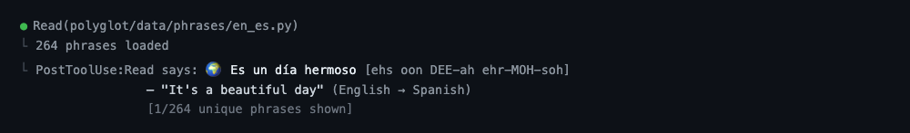

# Polyglot

Pick one of 70 language pairs and Polyglot installs a Claude Code + Codex hook that surfaces a phrase from that pair every Nth tool call — letters, vocab, full sentences with pronunciation, at least 250 items per pair (more than 18,000 total). Switching pairs never re-edits `settings.json`; only the active-pair config flips, so override is instant.



## Run

```bash
python3 -m polyglot    # or: polyglot
```

Use arrow keys and page controls to move across the paginated 70-pair grid. Press `Enter` to browse a pair's content by category, or `I` to install that pair as the active hook directly from the grid.

## Language Pairs

- **English → another language (52 pairs):** major European, Asian, African, and constructed-language options.
- **Another language → English (18 pairs):** reverse-direction learning for widely used source languages.

Each pair covers script/alphabet, numbers and time, core vocab (colors, family, food, drink, body, weather, animals, verbs, adjectives), travel/work phrases, and ~75 everyday sentences — every entry with a pronunciation hint (Hepburn, Revised Romanization, Pinyin, BGN/PCGN, IAST, ALA-LC, or English-friendly stress hints).

## Ambient Hook

The hook entry in `settings.json` always points at `polyglot/skill/hook.py`. On each fire it reads the active pair from polyglot's config, picks a phrase with the same variety algorithm as Bookshelf (deprioritize recently shown, exhaust unseen before repeating), and emits a `systemMessage`:

```
🌍 hola  [oh-LAH]
   — "hello" (English → Spanish)
   [1/264 unique phrases shown]
```

Picker state resets automatically when you switch pairs.

### Installing via the TUI

Open polyglot, pick a pair, press `I`. The installer:

1. Shows the current active pair (if any) and which target it's replacing.
2. Reports whether the Claude and Codex hooks are already installed.
3. Prints a unified diff of the proposed `~/.claude/settings.json` change.
4. Prompts for confirmation (`y/N`) before writing.
5. Falls back to printing the manual JSON/TOML snippet if the settings file can't be written.

Switch pairs any time by reopening polyglot and picking a different one — no further confirmation needed since the hook entry is already wired.

### CLI Installer

For headless or scripted setups:

```bash
python3 -m polyglot.skill.installer status               # show active pair + hook state
python3 -m polyglot.skill.installer install --pair en-es # confirm-and-install
python3 -m polyglot.skill.installer install --print      # print snippets only, no write
python3 -m polyglot.skill.installer install --yes        # skip confirmation
python3 -m polyglot.skill.installer set-pair en-ja       # switch pair without re-installing
python3 -m polyglot.skill.installer uninstall            # remove the Claude hook
```

### Manual Fallback

If the installer can't write the file, add to `~/.claude/settings.json`:

```json
{
  "hooks": {
    "PostToolUse": [
      {
        "hooks": [
          {
            "type": "command",
            "command": "python3 /path/to/terminal-arcade/polyglot/skill/hook.py",
            "timeout": 5
          }
        ]
      }
    ]
  }
}
```

And to `~/.codex/config.toml`:

```toml
notify = ["python3", "/path/to/terminal-arcade/polyglot/skill/codex_notify.py"]
```

## Cadence

```bash
python3 -m polyglot.skill.cadence              # show current
python3 -m polyglot.skill.cadence 10           # Claude: every 10th tool call
python3 -m polyglot.skill.cadence 20 --codex   # Codex: every 20th turn
python3 -m polyglot.skill.cadence 10 --both    # both
```

## Troubleshooting

**`ModuleNotFoundError: No module named 'polyglot'`** — run `pip install -e .` from the repo root.

**No phrases appearing** — confirm a pair is active: `python3 -m polyglot.skill.installer status` should show a non-empty `Active pair`. The hook fires every 5 tool calls by default. Verify the hook entry exists in `~/.claude/settings.json`.

**Want to switch language without re-confirming the JSON change** — open polyglot and pick a new pair (the active pair flips silently), or run `python3 -m polyglot.skill.installer set-pair en-ja`.

## License

[MIT](../LICENSE)
