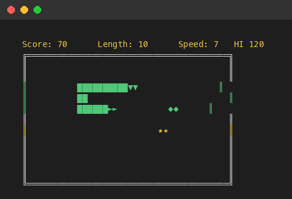
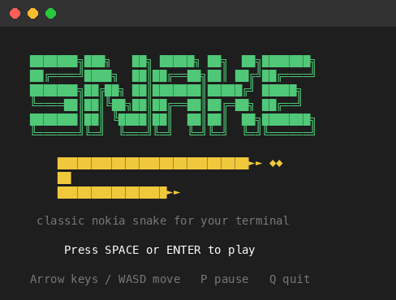
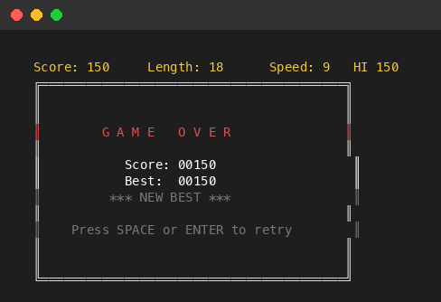

# Snake

A Nokia-style terminal snake game with wrapping edges, speed progression, and bonus food.



## Run

```bash
# From the repo root
python3 -m snake_game

# Or install and run anywhere
pip install -e .
snake-game
```

## Controls

| Key | Action |
|---|---|
| Arrow keys / `WASD` | Change direction |
| `Space` / `Enter` | Start / Restart |
| `P` | Pause / Resume |
| `Q` / `Esc` | Quit |

## Gameplay

- Snake wraps around edges (exits right, appears on left — classic Nokia behavior)
- Game over on self-collision only
- Speed increases every 5 food items (6 → 14 moves/sec)
- Regular food (◆) = 10 points
- Bonus food (★) = 30 points, appears randomly and blinks before disappearing



## Scoring

- +10 per regular food
- +30 per bonus food
- Speed increases every 5 food items eaten
- High score saved locally to `~/Library/Application Support/snake-game/high_score.json` (macOS)



## License

[MIT](../LICENSE)
