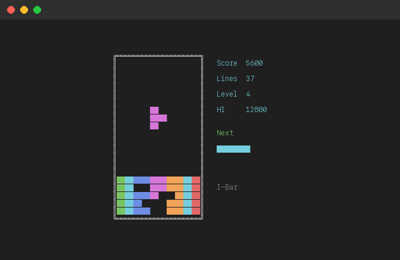
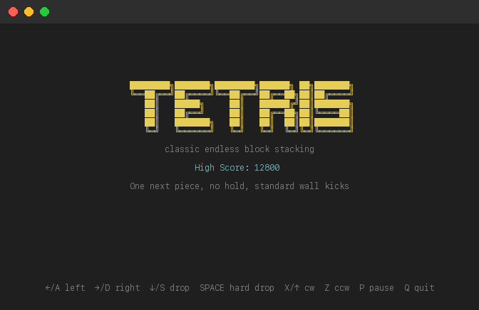

# Tetris

Classic endless Tetris for the terminal arcade with one next-piece preview, standard wall kicks, level-based speed-up, and persistent high scores.



## Run

```bash
# From the repo root
python3 -m tetris_game

# Or install and run anywhere
pip install -e .
tetris
```

## Controls

| Key | Action |
|---|---|
| `Left` / `A` | Move left |
| `Right` / `D` | Move right |
| `Down` / `S` | Soft drop |
| `Space` | Hard drop |
| `Up` / `X` | Rotate clockwise |
| `Z` | Rotate counterclockwise |
| `P` | Pause / Resume |
| `Enter` / `Space` | Start / Restart |
| `Q` / `Esc` | Quit |

## Gameplay

- Endless marathon on a `10x20` board
- Standard 7-bag randomizer
- One next-piece preview
- Standard wall kicks
- Level increases every 10 cleared lines
- Top-out ends the run

## Scoring

- Single: `100 x level`
- Double: `300 x level`
- Triple: `500 x level`
- Tetris: `800 x level`
- Soft drop: `+1` per row
- Hard drop: `+2` per row

High score is stored locally in `tetris-game/high_score.json` under your platform app-data directory.



## License

[MIT](../LICENSE)
